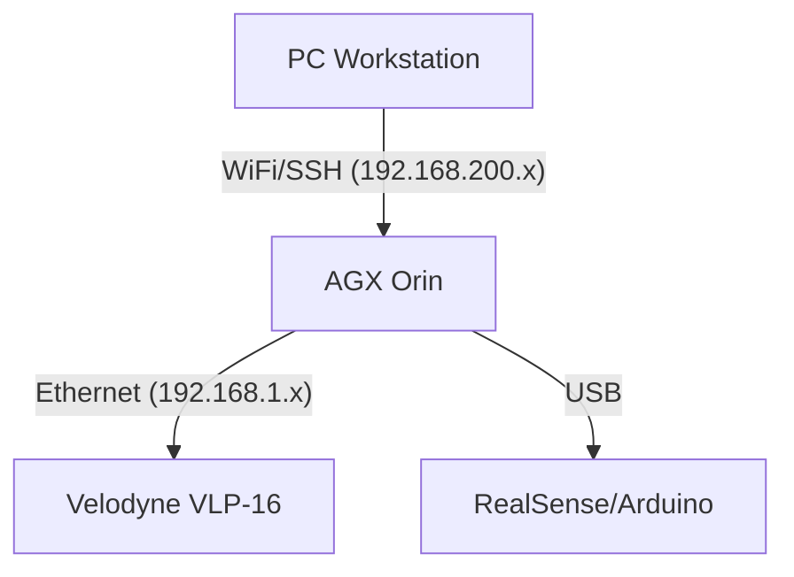

# AGX Hybrid Navigation System (ROS 1 Noetic + ROS 2 Humble)

  

This is a **Docker-based** hybrid navigation system designed specifically for the **NVIDIA Jetson AGX Orin (JetPack 6)** platform. The project adopts modern DevOps workflows, enabling cross-compilation on a PC and one-click remote deployment to the edge device.


## 🏗️ System Architecture

The project utilizes a **dual-track architecture** with containerized isolation:

| Container | Role & Description |
| --- | --- |
| **`control`** | **[ROS 1 Noetic]** Handles low-level hardware drivers (Velodyne LiDAR, RealSense) and 3D SLAM algorithms. |
| **`bridge`** | **[ROS 1 Bridge]** A dedicated bridge using `ros1_bridge` to enable seamless topic communication between Noetic and Humble. |
| **`planning`** | **[ROS 2 Humble]** Responsible for high-level path planning (Nav2, Costmap) and behavior trees. |
| **`foxglove`** | **[Visualization]** Runs a high-performance WebSocket server for remote visualization (replaces the heavy RViz client). |
| **`isaac_ros`** | **[Perception]** Leverages NVIDIA Isaac ROS for GPU-accelerated VSLAM and AI perception tasks. |


### 🌐 Network Topology



-----

## 🚀 Quick Start (The "Makefile" Way)

We use a **Makefile** to automate complex Docker commands.

| Command | Description |
| :--- | :--- |
| **`make up`** | 🚀 **Start System**. Auto-detects PC/AGX mode. |
| **`make build`** | 🛠️ **Build Images**. Run this if you changed `Dockerfile`. |
| **`make rebuild`** | 🔄 **Rebuild + Start**. Clean restart after updates. |
| **`make down`** | 🛑 **Stop System**. Stops containers and removes networks. |
| **`make join`** | 🐳 **Enter Container**. Defaults to `isaac_ros`. |
| **`make logs`** | 📄 **View Logs**. Real-time logs from all services. |

### 🎯 Target Specific Services

You can target specific services to save time (e.g., only rebuilding the planning node).

| Argument | Usage Example | Description |
| :--- | :--- | :--- |
| **`s=<name>`** | `make rebuild s=planning` | Applies `up`, `down`, `build`, or `rebuild` to a **single service**. |
| **`service=<name>`** | `make join service=control` | Specifies which container to enter with `make join`. |


### Mode B: Remote Deployment (PC -\> AGX)

***Best for:** Clean builds, environment updates, and deploying from your powerful PC.*

1.  Switch your Docker context to the AGX:
    ```bash
    docker context use agx_remote
    ```
2.  Deploy (Build on PC, Run on AGX):
    ```bash
    # The Makefile detects the remote context and switches to AGX mode automatically
    make rebuild
    ```
3.  Switch back to local when done:
    ```bash
    docker context use default
    ```
> **Note**: In this mode, containers use the code baked into the Docker Image. Local source files on the AGX are **not** mounted.
-----

## 📊 Visualization (Foxglove Studio)


This project uses **Foxglove Studio** instead of RViz for remote monitoring.


1.  **Open Foxglove Studio** (On PC).

2.  **Connection Setup**:

      * Source: `Foxglove WebSocket`

      * URL: `ws://<AGX_IP>:8765` (AGX WiFi IP)

3.  **Common Topics**:

      * `Map`: `/globalmap` (PointCloud2)

      * `LiDAR`: `/velodyne_points` (PointCloud2)

      * `Path`: `/global_path` (MarkerArray)

      * `Robot`: `/tf`


> **Tip**: If connected but no data appears, check if the Topic QoS settings in Foxglove are set to **Reliable**


-----


## 📝 Hardware Notes


### Velodyne LiDAR Setup


The LiDAR uses Ethernet UDP. You must configure the AGX's wired interface (`eth0`) to a separate subnet.


  * **LiDAR IP**: `192.168.1.201` (Default)

  * **AGX eth0 IP**: `192.168.1.x` (Manual Static IP, e.g., 77)

  * **Docker Port Mapping**: `2368:2368/udp`


-----


## 🗓️ Roadmap


  - [x] **Phase 1**: Establish AGX JetPack 6 Hybrid Architecture (ROS 1 + ROS 2)

  - [x] **Phase 2**: Implement Buildx Remote Deployment Workflow

  - [x] **Phase 3**: Integrate Hardware Drivers (Velodyne, RealSense) & Docker Network Passthrough

  - [x] **Phase 4**: Replace RViz with Foxglove Studio for Web-based Viz

  - [ ] **Phase 5**: Deploy Nav2 Stack and bridge with SLAM maps

  - [ ] **Phase 6**: Integrate VLM/RL models into ROS 2 nodes for AI Navigation

## 👥 For New Team Members (One-Time Setup)

If you are new to the project, follow these steps to set up your PC for remote deployment.

### 1\. Generate SSH Key (On PC)

skip this if you already have one.

```bash
ssh-keygen -t ed25519 -C "your_name@pc"
```

### 2\. Authorize Key on AGX

Ask the lead for the AGX password, then copy your key:

```bash
ssh-copy-id systemlabagx@<AGX_IP>
```

### 3\. Create Docker Remote Context

This allows your local Docker CLI to control the Docker Engine on the AGX.

```bash
# Replace <AGX_IP> with the actual IP (e.g., 192.168.200.112)
docker context create agx_remote --docker "host=ssh://systemlabagx@<AGX_IP>"

# Verify connection
docker --context agx_remote info
```

**Maintainer**: NYCUSystemLab